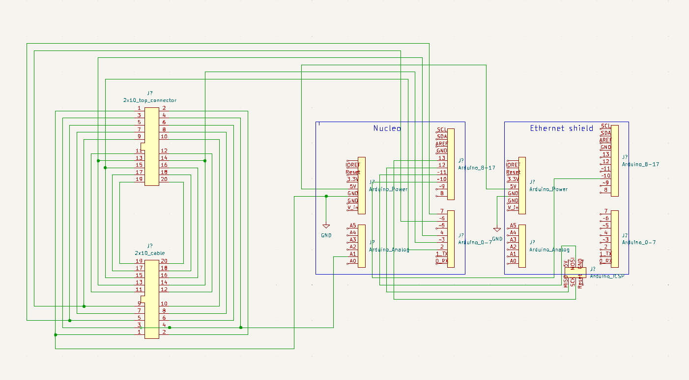

# Treadmill Driver

This code is designed to replace the front panel of the Vision Fitness
[T9800 treadmill](https://www.toughtrain.com/vision-fitness/vision-fitness-treadmills/vision-t9800hrt-platform-treadmill) (now discontinued),
interfacing directly with the motor controller board in the bottom.

## Usage

See the [API doc](docs/API.md) for recommended usage. You can still use the old way though:

Hold the Nucleo's user button down to raise the treadmill, increasing the elevation. Hold the button down a second time to lower it.
Hold it a third time to raise it again, and so on. The current elevation will be displayed on the LCD screen.

## Hardware

* STM32 Nucleo [G071RB](https://www.st.com/en/evaluation-tools/nucleo-g071rb.html), because it runs at 3.3V.
* A [I2C 1602 LCD](http://www.handsontec.com/dataspecs/module/I2C_1602_LCD.pdf) display, for displaying the current elevation.
* An [Arduino ethernet shield V1](https://docs.arduino.cc/retired/shields/arduino-ethernet-shield-without-poe-module).

## Setup

In Arduino IDE,

1. Add https://github.com/stm32duino/BoardManagerFiles/raw/main/package_stmicroelectronics_index.json to *Additional boards manager URLs* in the preferences.
1. In Tools > Board > Boards Manager, search for Nucleo. Add *STM32 MCU based boards*.
1. In Tools > Board > STM32 MCU based boards, choose *Nucleo-64*. Avoid *Generic STM32G0 series*.
1. In Tools > Board part number, choose *Nucleo G071RB*.
1. In the library manager, install [LiquidCrystal I2C](https://github.com/johnrickman/LiquidCrystal_I2C), [Ethernet](https://www.arduino.cc/reference/en/libraries/ethernet/) and [MQTT](https://github.com/256dpi/arduino-mqtt).

Then hook everything up according to this schematic:

