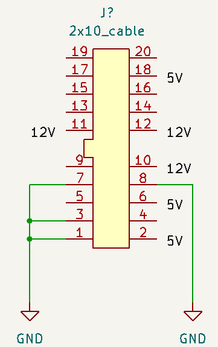
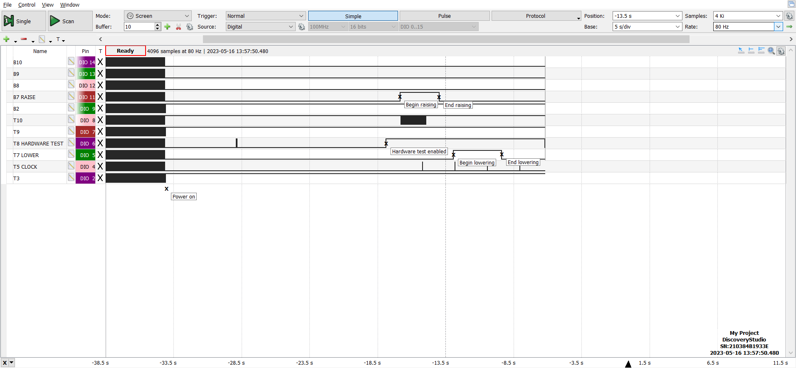
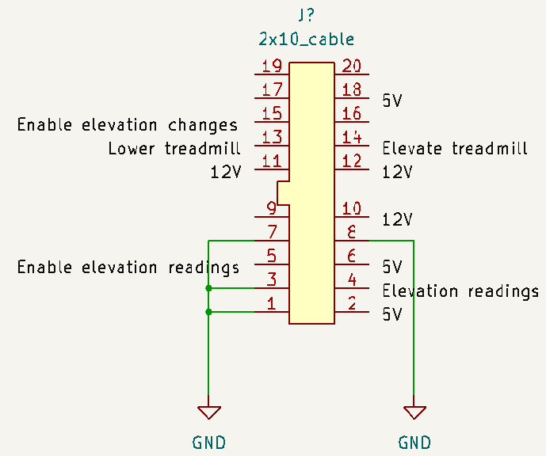
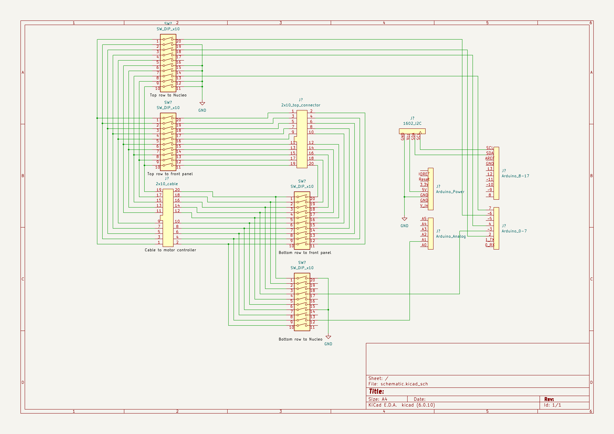
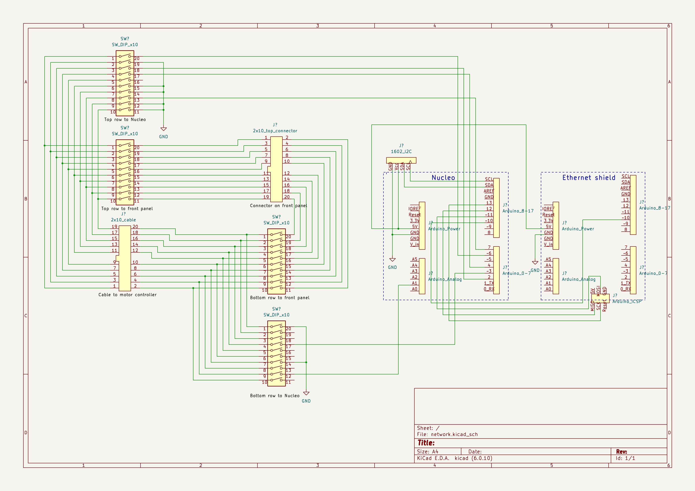
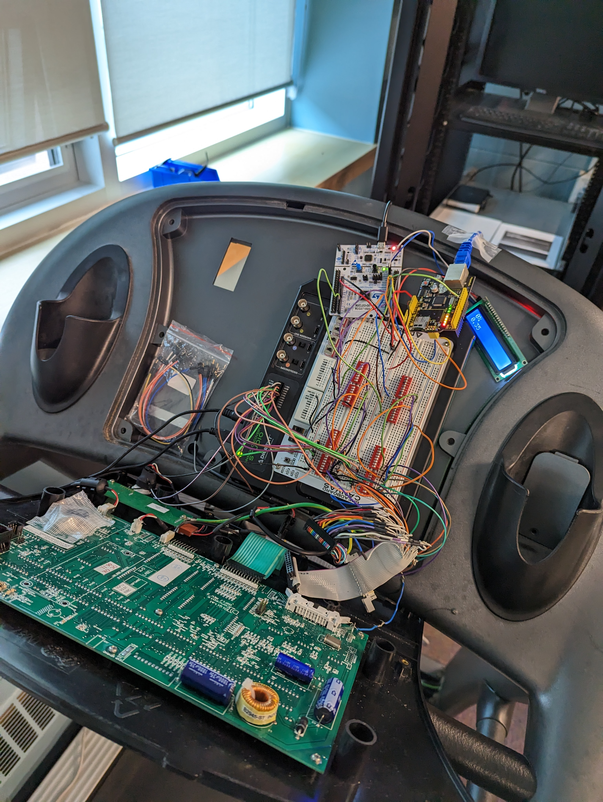
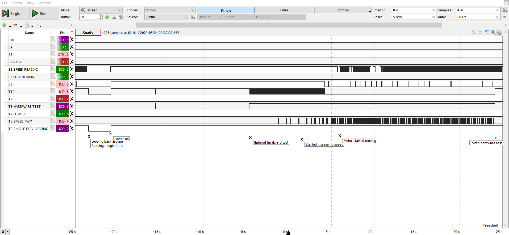
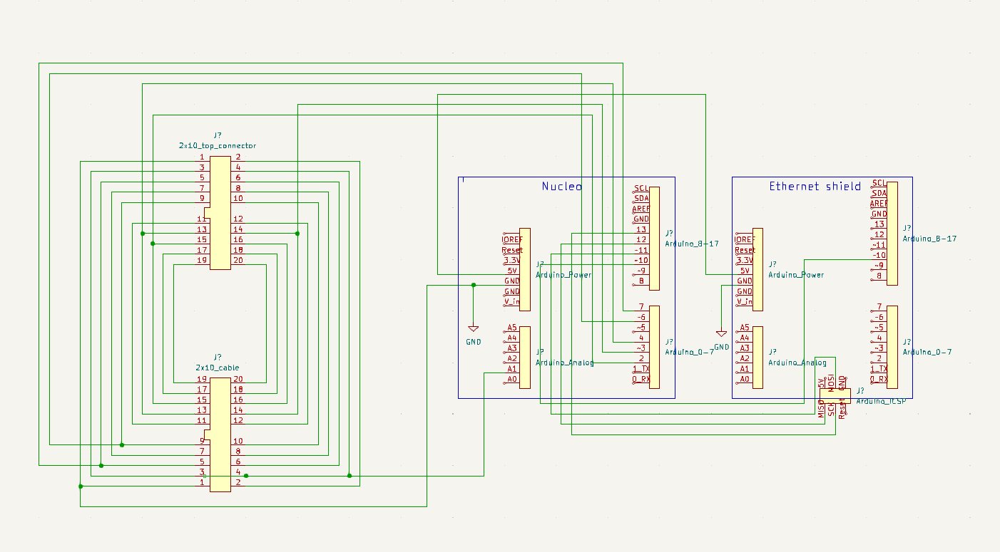

# The journey to a fancy smart treadmill

The goal of this project was to replace the front panel of the
[T9800 treadmill](https://www.toughtrain.com/vision-fitness/vision-fitness-treadmills/vision-t9800hrt-platform-treadmill) with a touchscreen.
I had some web developers to handle the UI, so my job was to interface with the treadmill's motor controller and make it available over a
network.

There was no technical documentation for the treadmill. The JTAG headers didn't work, nor did the
[CSAFE](https://en.wikipedia.org/wiki/Communications_Specification_for_Fitness_Equipment) port, so I was left with reverse-engineering the
signals between the top panel and the motor controller. I did find a engineering manual for repairmen though, which revealed the secret
engineering mode. That gave me direct control of the motors, which made deciphering the signals easier.

## Initial discovery

The first step was to disconnect the cable running from the front panel to the motor controller, and patch it through a breadboard. I used
the [Analog Discovery Studio](https://digilent.com/reference/test-and-measurement/analog-discovery-studio/start), so that I could take
advantage of its logic analyzer. But the first step was to grab the multimeter and find the power and ground lines. I found three 12V lines,
three 5V lines and four ground lines, leaving me with ten communication lines.

Next, I wired in the DIO pins of the Analog Discovery Studio and took some readings with the logic analyzer. Running through the motions,
I came to believe that elevation was the simplest part, so I started with that. I entered engineering mode, drilled down to the hardware
test, then changed the elevation. Here is what I read:

## Deciphering elevation

Clearly, pins 13 (T7) and 14 (B7) control the elevation motor. The hardware test pulls pin 15 (T8) high, and there's a clock running on pin
9 (T5). The other pins going high were a mystery. That was enough to get started. I branched the motor controller cable to a second location
on the breadboard, and added some dip switches to each location. Then I hooked a Raspberry Pi into the new location, because that would make
it easy to provide a REST API for the web devs. With the switches in place, I could switch between the Pi and the front panel without moving
wires around.

Experimentation and trial & error got me some results: Hold pin 15 high, then use pins 13 and 14 to change the elevation (see the [protocol doc](protocol.md)). Everything else turned out to be unnecessary.

Elevation readings proved a bit trickier though. Upon closer inspection with an oscilloscope, I discovered that pin 4 is an analog signal
representing the elevation. The Raspberry Pi doesn't have an ADC, so I switched to an Arduino. The problem with the Arduino is that it
generates 5V signals, while the front panel sends 3.3V signals. I grabbed some resistors and set up some voltage dividers to fix that. But
that presented a new problem: while the Arduino was now sending 3.3V signals in isolation, they dropped to 2V signals when connected to the
motor controller, which were interpreted as digital 0. Rather than finding yet another fix, I switched to an STM32 Nucleo board, which
generates 3.3V signals. That solved the problem and made my circuitry simpler.

With that out of the way, experimentation could continue. I was initially unable to read the elevation, but I eventually discovered that you
need to hold pin 5 high to make the sensor work. And that was all I needed to reach my first milestone: a working elevation demo. See git
tag: v0.1-elevation for the result.

## Putting it on the network

The next job was to put the treadmill on the network, so that the web devs could start communicating with it. So I added an
[ethernet shield](https://docs.arduino.cc/retired/shields/arduino-ethernet-shield-without-poe-module) to the mix. That turned out to be
a bit trickier than expected. Unlike most shields, that one doesn't respond to the standard SPI pins, except for chip select. Instead,
it uses the SPI pins of the ICSP headers. That made wiring tough, but it was straightforward enough once I saw the problem.

From there, it was relatively smooth sailing. I installed [mosquitto](https://mosquitto.org/) on the touchscreen, and added some code
to communicate with it. See git tag: v0.2-mqtt for the result.

## Moving the tread

Then it was time to do the most important part: control the speed, so that the treadmill could actually be used. This proved to be quite
problematic, because I was stymied by faulty connections. Switching back to the front panel, I couldn't get the motor to move. However,
it worked if I unplugged all my wires and plugged the cable directly into the front panel, as it shipped from the factory. I plugged my
wires back in and tested continuity on every part of it. Everything looked peachy, so I tried to run the treadmill, but the motor still
wouldn't turn.

Assuming that some of my wires were low quality, I cut my own wires off some spools of wire. 40 snips and 80 ends stripped later, I had
everything hooked up with presumably good connections. And yet, that motor still refused to move. In the end, I made a ribbon cable to
connect the built-in cable to the front panel, and added a third connector in the middle of the ribbon. The third connector gave me a
spot to hook up the Nucleo, the logic analyzer, the oscilloscope and the multimeter. And **finally**, a whole week later, it worked!

Now I could get some readings, and I was off to the races. This is what I saw:

Looking closer with the oscilloscope, I could see that the speed control was a simple PWM signal. The speed sensor was a bit trickier.
It looks like a PWM signal, but the duty cycle was always 50%. Instead, the period decreases as the speed increases. That turned out to
be due to the nature of the sensor itself &mdash; a cog wheel with a magnetic sensor to sense cogs and gaps.

All that was left was calibration. I had initially tried measuring the period with the oscilloscope, and then comparing it to the speed
reported by the front panel, but that gave wildly inaccurate results. After a few variations on that strategy, I gave up and just timed
the tread with a stopwatch. Once I had some data points [desmos](https://www.desmos.com/calculator) made finding the curve of best fit
easy.

## Final stretch

And that was just about it. I put the speed sensor and speed control on MQTT, and the web devs made the treadmill dance from their fancy
UI on the touchscreen. Mission accomplished! Well, sort of. The project was over, and I hadn't even got started on the heart rate sensor.
Still, I'm happy with what I achieved.

A big thanks to my teacher Brian Shewan for helping me through the hard parts!